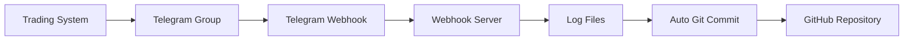
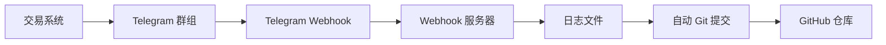

# Trading Logs - Automated Evidence System

<div align="center">

**Automated trading logs for evidence verification**

[🇨🇳 切换到中文](#trading-logs-自动化留痕系统) | [📊 View on GitHub](https://github.com/deeptradings/autotrading)


</div>

---

## 📋 Overview

This repository automatically captures trading notifications from Telegram and syncs them to GitHub for evidence verification (留痕验证).

## 🤖 How It Works



1. **Trading notifications** are sent to Telegram group `Aibotlogs`
2. **Webhook server** captures messages in real-time
3. **Logs** are written to `logs/YYYY-MM-DD.log`
4. **Auto commit & push** to GitHub for permanent evidence

## 📁 Directory Structure

```
trading-logs/
├── logs/                  # Daily trading logs
│   └── YYYY-MM-DD.log     # Log files by date
├── webhook-server.py      # Telegram webhook server
├── auto-push.sh           # Git auto-push script
├── setup-webhook.sh       # Webhook setup script
├── keep-tunnel-alive.sh   # Tunnel keepalive script
├── .env                   # Environment variables (gitignored)
└── README.md              # This file
```

## 📝 Log Format Example

```log
[2026-02-23T13:35:46+08:00] TELEGRAM 🧪 Webhook Test Message

OPEN BTC/USDT LONG @ 52340.5 qty: 0.1
Time: 2026-02-23T13:31:59+08:00
```

## 🚀 Quick Start

### 1. Clone Repository

```bash
git clone https://github.com/deeptradings/autotrading.git
cd autotrading
```

### 2. Configure Environment

Create `.env` file:

```bash
cp .env.example .env
```

Edit `.env`:

```bash
GITHUB_TOKEN=ghp_xxx
TELEGRAM_BOT_TOKEN=1234567890:ABCdef...
TELEGRAM_CHAT_ID=-1003784966844
```

### 3. Setup Webhook

```bash
# Start webhook server
systemctl start telegram-webhook

# Configure HTTPS tunnel and Telegram webhook
./setup-webhook.sh
```

### 4. Test

Send a message to Telegram group `Aibotlogs`, then check:
- `logs/YYYY-MM-DD.log` - Log file
- `webhook.log` - Webhook server log
- GitHub commits - Auto-push records

## 🔧 Components

| Component | Description |
|-----------|-------------|
| **webhook-server.py** | Python HTTP server receiving Telegram webhooks (port 8080) |
| **setup-webhook.sh** | Configures localtunnel HTTPS tunnel and Telegram webhook |
| **keep-tunnel-alive.sh** | Keeps tunnel connection alive with auto-reconnect |
| **auto-push.sh** | Auto git commit and push to GitHub |

## 📊 Verification Commands

```bash
# Check webhook status
curl -s "https://api.telegram.org/botTOKEN/getWebhookInfo" | jq .

# Check service status
systemctl status telegram-webhook

# View today's logs
cat logs/$(date +%Y-%m-%d).log

# View webhook logs
tail -f webhook.log

# View git history
git log --oneline
```

## 🔐 Security

- `.env` file is gitignored (never commit tokens)
- Token permissions: 600 (owner read/write only)
- Webhook uses HTTPS encryption (localtunnel)
- Regular GitHub sync verification recommended

## ⚠️ Important Notes

1. **Bot Privacy Mode**: Must be disabled via @BotFather → Bot Settings → Group Privacy → Turn off
2. **Re-add Required**: After privacy change, bot must be removed and re-added to group
3. **Bot Messages Excluded**: Bot's own messages don't trigger webhook (Telegram design)
4. **localtunnel URL Changes**: Each restart generates new URL, re-run `setup-webhook.sh`
5. **Zero LLM Calls**: Pure system-level automation, no AI/LLM usage

## 🆘 Troubleshooting

```bash
# Check webhook server
systemctl status telegram-webhook

# View recent errors
tail -50 webhook.log

# Test health endpoint
curl http://localhost:8080/health

# Check tunnel status
cat .tunnel_pid 2>/dev/null && ps aux | grep lt

# Reconfigure webhook
./setup-webhook.sh
```

## 📞 Support

- **Issues**: [GitHub Issues](https://github.com/deeptradings/autotrading/issues)
- **Telegram**: @lance_aibot

---

<div align="center">

**Built with ❤️ for transparent trading evidence**

[⬆ Back to Top](#trading-logs---automated-evidence-system)

</div>

---

# Trading Logs - 自动化留痕系统

<div align="center">

**自动化捕获交易通知并同步到 GitHub 进行留痕验证**

[🇺🇸 Switch to English](#trading-logs---automated-evidence-system) | [📊 查看 GitHub 仓库](https://github.com/deeptradings/autotrading)


</div>

---

## 📋 系统概述

本仓库自动从 Telegram 捕获交易通知并同步到 GitHub，用于交易留痕验证。

## 🤖 工作原理



1. **交易通知** 发送到 Telegram 群组 `Aibotlogs`
2. **Webhook 服务器** 实时捕获消息
3. **日志** 写入 `logs/YYYY-MM-DD.log`
4. **自动提交并推送** 到 GitHub 永久留痕

## 📁 目录结构

```
trading-logs/
├── logs/                  # 每日交易日志
│   └── YYYY-MM-DD.log     # 按日期分割的日志文件
├── webhook-server.py      # Telegram Webhook 服务器
├── auto-push.sh           # Git 自动推送脚本
├── setup-webhook.sh       # Webhook 配置脚本
├── keep-tunnel-alive.sh   # 隧道保活脚本
├── .env                   # 环境变量（已 gitignore）
└── README.md              # 本文件
```

## 📝 日志格式示例

```log
[2026-02-23T13:35:46+08:00] TELEGRAM 🧪 Webhook 测试消息

OPEN BTC/USDT LONG @ 52340.5 qty: 0.1
时间：2026-02-23T13:31:59+08:00
```

## 🚀 快速开始

### 1. 克隆仓库

```bash
git clone https://github.com/deeptradings/autotrading.git
cd autotrading
```

### 2. 配置环境变量

创建 `.env` 文件：

```bash
cp .env.example .env
```

编辑 `.env`：

```bash
GITHUB_TOKEN=ghp_xxx
TELEGRAM_BOT_TOKEN=1234567890:ABCdef...
TELEGRAM_CHAT_ID=-1003784966844
```

### 3. 设置 Webhook

```bash
# 启动 Webhook 服务器
systemctl start telegram-webhook

# 配置 HTTPS 隧道和 Telegram Webhook
./setup-webhook.sh
```

### 4. 测试

向 Telegram 群组 `Aibotlogs` 发送消息，然后检查：
- `logs/YYYY-MM-DD.log` - 日志文件
- `webhook.log` - Webhook 服务器日志
- GitHub 提交记录 - 自动推送记录

## 🔧 组件说明

| 组件 | 说明 |
|------|------|
| **webhook-server.py** | Python HTTP 服务器，接收 Telegram Webhook 推送（端口 8080） |
| **setup-webhook.sh** | 配置 localtunnel HTTPS 隧道和 Telegram Webhook |
| **keep-tunnel-alive.sh** | 保持隧道连接，自动重连 |
| **auto-push.sh** | 自动 Git 提交并推送到 GitHub |

## 📊 验证命令

```bash
# 检查 Webhook 状态
curl -s "https://api.telegram.org/botTOKEN/getWebhookInfo" | jq .

# 检查服务状态
systemctl status telegram-webhook

# 查看今日日志
cat logs/$(date +%Y-%m-%d).log

# 查看 Webhook 日志
tail -f webhook.log

# 查看 Git 历史
git log --oneline
```

## 🔐 安全提示

- `.env` 文件已加入 gitignore（切勿提交 Token）
- Token 权限：600（仅所有者可读写）
- Webhook 使用 HTTPS 加密（localtunnel）
- 建议定期检查 GitHub 同步状态

## ⚠️ 重要说明

1. **机器人隐私模式**：必须通过 @BotFather → Bot Settings → Group Privacy → Turn off 禁用
2. **需要重新添加**：隐私设置变更后，机器人必须从群组移除后重新添加
3. **机器人消息排除**：机器人自己发送的消息不会触发 Webhook（Telegram 设计）
4. **localtunnel URL 会变**：每次重启生成新 URL，需重新运行 `setup-webhook.sh`
5. **零大模型调用**：纯系统级自动化，不使用任何 AI/LLM

## 🆘 故障排查

```bash
# 检查 Webhook 服务器
systemctl status telegram-webhook

# 查看最近错误
tail -50 webhook.log

# 测试健康检查端点
curl http://localhost:8080/health

# 检查隧道状态
cat .tunnel_pid 2>/dev/null && ps aux | grep lt

# 重新配置 Webhook
./setup-webhook.sh
```

## 📞 支持

- **问题反馈**: [GitHub Issues](https://github.com/deeptradings/autotrading/issues)
- **Telegram**: @lance_aibot

---

<div align="center">

**为透明交易留痕而建 ❤️**

[⬆ 返回顶部](#trading-logs---自动化留痕系统)

</div>
