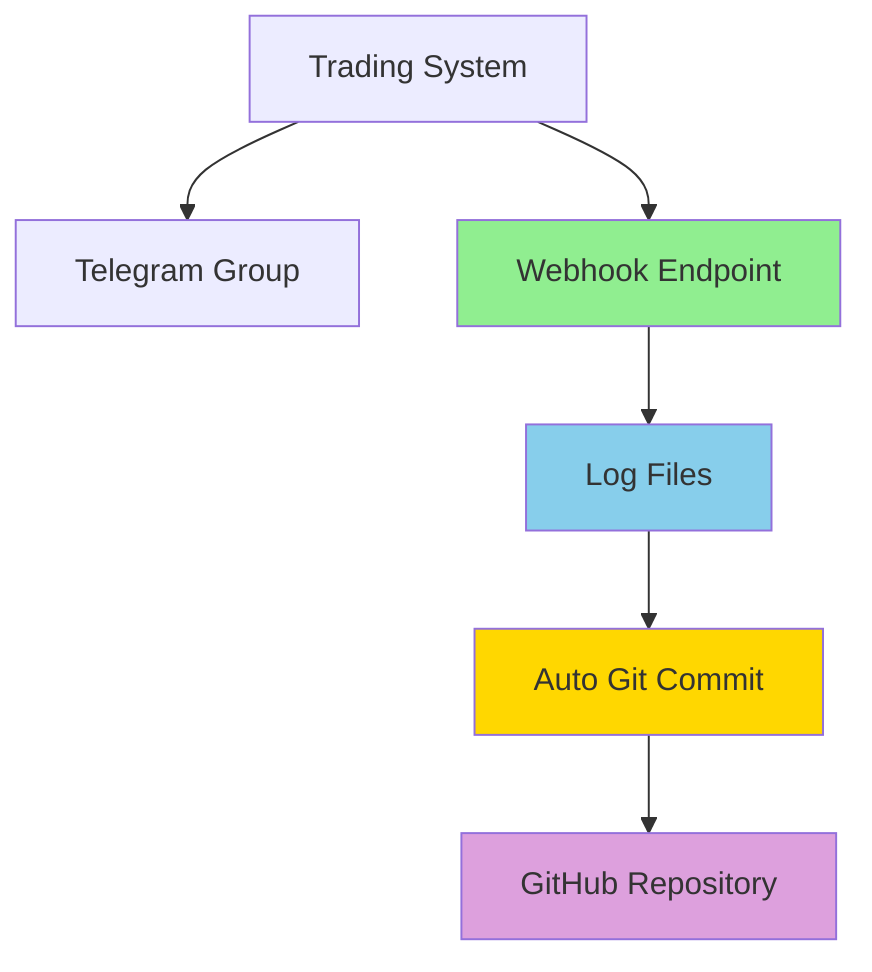
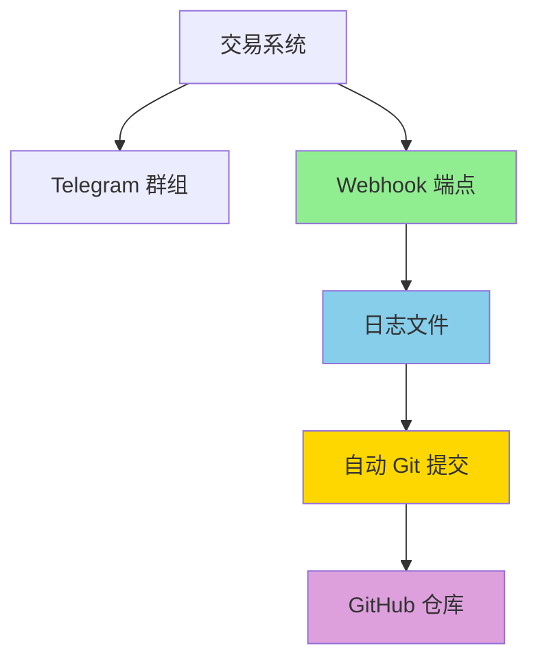

# Trading Logs - Automated Evidence System

<div align="center">

**Automated trading logs for evidence verification**

[🇨🇳 切换到中文](#trading-logs-自动化留痕系统) | [📊 View on GitHub](https://github.com/deeptradings/autotrading)


</div>

---

## 📋 Overview

This repository provides a **direct webhook endpoint** that receives trading notifications from your trading system and automatically syncs them to GitHub for evidence verification (留痕验证).

## 🤖 Architecture



**Two parallel branches from Trading System:**

1. **Telegram Group** → Manual monitoring and alerts
2. **Webhook Endpoint** → Automated logging and GitHub sync

## 🚀 How It Works

```
┌─────────────────┐
│ Trading System  │
└────────┬────────┘
         │
    ┌────┴────┐
    │         │
    ▼         ▼
┌─────────┐ ┌──────────────────┐
│Telegram │ │ Webhook Endpoint │
│  Group  │ │  (Python Server) │
└─────────┘ └────────┬─────────┘
                     │
                     ▼
              ┌──────────────┐
              │  Log Files   │
              │YYYY-MM-DD.log│
              └──────┬───────┘
                     │
                     ▼
              ┌──────────────┐
              │Auto Git Push │
              └──────┬───────┘
                     │
                     ▼
              ┌──────────────┐
              │   GitHub     │
              │  Repository  │
              └──────────────┘
```

### Flow Steps

1. **Trading System** sends webhook to your endpoint on every trade
2. **Webhook Server** receives and validates the payload
3. **Log Entry** is written to daily log file (`logs/YYYY-MM-DD.log`)
4. **Auto Commit** stages changes and commits with timestamp
5. **Auto Push** syncs to GitHub for permanent evidence

## 📁 Directory Structure

```
trading-logs/
├── logs/                      # Daily trading logs
│   └── YYYY-MM-DD.log         # Log files by date
├── trading-webhook.py         # Webhook endpoint server
├── auto-push.sh               # Git auto-push script
├── setup-webhook.sh           # Legacy Telegram setup (optional)
├── .env                       # Environment variables (gitignored)
├── .env.example               # Example environment file
└── README.md                  # This file
```

## 📝 Log Format Example

```log
[2026-02-23T13:35:46.123456] OPEN BTC/USDT LONG @ 52340.5 qty: 0.1 order_id: 12345
# Raw: {"action": "open", "symbol": "BTC/USDT", "side": "long", "price": 52340.5, ...}

[2026-02-23T14:12:33.654321] CLOSE BTC/USDT LONG @ 52580.0 qty: 0.1 pnl: +23.95 USDT order_id: 12346
# Raw: {"action": "close", "symbol": "BTC/USDT", "side": "long", "price": 52580.0, "pnl": 23.95, ...}
```

## 🔧 Setup Guide

### 1. Clone Repository

```bash
git clone https://github.com/deeptradings/autotrading.git
cd autotrading
```

### 2. Configure Environment

```bash
cp .env.example .env
```

Edit `.env`:

```bash
# GitHub Configuration
GITHUB_TOKEN=ghp_xxx

# Webhook Configuration
WEBHOOK_PORT=8080
WEBHOOK_SECRET=your_secure_secret_token

# Telegram Configuration (optional)
TELEGRAM_BOT_TOKEN=
TELEGRAM_CHAT_ID=
```

### 3. Start Webhook Server

```bash
# Reload systemd
systemctl daemon-reload

# Enable and start service
systemctl enable trading-webhook
systemctl start trading-webhook

# Check status
systemctl status trading-webhook
```

### 4. Configure Trading System

Set your trading system's webhook endpoint:

```
URL: http://<your-server-ip>:8080/
Method: POST
Content-Type: application/json
Secret Token: your_secure_secret_token (optional, for signature)
```

**Example webhook payload:**

```json
{
  "action": "open",
  "symbol": "BTC/USDT",
  "side": "long",
  "price": 52340.5,
  "quantity": 0.1,
  "order_id": "12345",
  "timestamp": "2026-02-23T13:35:46Z"
}
```

### 5. Test Webhook

```bash
# Test health endpoint
curl http://localhost:8080/health

# Test status endpoint
curl http://localhost:8080/status

# Send test webhook
curl -X POST http://localhost:8080/ \
  -H "Content-Type: application/json" \
  -d '{"action":"test","symbol":"BTC/USDT","side":"long","price":50000}'
```

## 🔌 API Endpoints

| Endpoint | Method | Description |
|----------|--------|-------------|
| `/` | POST | Webhook receiver |
| `/health` | GET | Health check |
| `/status` | GET | Server status with git info |

### Webhook Payload Format

The server accepts any JSON payload. Common fields:

```json
{
  "action": "open|close|modify|cancel",
  "symbol": "BTC/USDT",
  "side": "long|short|buy|sell",
  "price": 52340.5,
  "quantity": 0.1,
  "order_id": "12345",
  "pnl": 23.95,
  "timestamp": "2026-02-23T13:35:46Z"
}
```

### Signature Verification (Optional)

If `WEBHOOK_SECRET` is configured, include signature header:

```
X-Webhook-Signature: sha256=<hmac_signature>
```

## 📊 Verification Commands

```bash
# Check service status
systemctl status trading-webhook

# View today's logs
cat logs/$(date +%Y-%m-%d).log

# View webhook logs
tail -f webhook.log

# View git history
cd /root/.openclaw/workspace/trading-logs
git log --oneline

# Test endpoints
curl http://localhost:8080/health
curl http://localhost:8080/status
```

## 🔐 Security

- **`.env` file** is gitignored (never commit tokens)
- **Token permissions**: 600 (owner read/write only)
- **Signature verification**: HMAC-SHA256 (optional)
- **Concurrent push protection**: File lock prevents race conditions
- **HTTPS**: Use reverse proxy (nginx) for production

### Production Deployment

For production, use HTTPS with nginx:

```nginx
server {
    listen 443 ssl;
    server_name your-domain.com;
    
    ssl_certificate /path/to/cert.pem;
    ssl_certificate_key /path/to/key.pem;
    
    location / {
        proxy_pass http://localhost:8080;
        proxy_set_header Host $host;
        proxy_set_header X-Real-IP $remote_addr;
    }
}
```

## ⚠️ Important Notes

1. **Webhook URL**: Configure your trading system to send to `http://<server-ip>:8080/`
2. **Signature**: Use `WEBHOOK_SECRET` for payload verification (recommended)
3. **Git Remote**: Ensure git remote is configured for auto-push
4. **Zero LLM Calls**: Pure system-level automation, no AI/LLM usage
5. **Dual Branch**: Telegram group is optional for manual monitoring

## 🆘 Troubleshooting

```bash
# Check service
systemctl status trading-webhook

# View recent errors
tail -50 webhook.log

# Test health endpoint
curl http://localhost:8080/health

# Check git configuration
cd /root/.openclaw/workspace/trading-logs
git remote -v
git status

# Restart service
systemctl restart trading-webhook

# Manual test
curl -X POST http://localhost:8080/ \
  -H "Content-Type: application/json" \
  -d '{"action":"test"}'
```

## 📞 Support

- **Issues**: [GitHub Issues](https://github.com/deeptradings/autotrading/issues)
- **Telegram**: @jimmy_tt18

---

<div align="center">

**Built with ❤️ for transparent trading evidence**

[⬆ Back to Top](#trading-logs---automated-evidence-system)

</div>

---

# Trading Logs - 自动化留痕系统

<div align="center">

**直接接收交易 webhook 并自动同步到 GitHub 进行留痕验证**

[🇺🇸 Switch to English](#trading-logs---automated-evidence-system) | [📊 查看 GitHub 仓库](https://github.com/deeptradings/autotrading)


</div>

---

## 📋 系统概述

本仓库提供**直接 webhook 端点**，从交易系统接收交易通知并自动同步到 GitHub，用于交易留痕验证。

## 🤖 系统架构



**交易系统的两个并行分支：**

1. **Telegram 群组** → 人工监控和告警
2. **Webhook 端点** → 自动化日志和 GitHub 同步

## 🚀 工作流程

```
┌─────────────────┐
│    交易系统     │
└────────┬────────┘
         │
    ┌────┴────┐
    │         │
    ▼         ▼
┌─────────┐ ┌──────────────────┐
│Telegram │ │ Webhook 端点      │
│  群组   │ │  (Python 服务器)  │
└─────────┘ └────────┬─────────┘
                     │
                     ▼
              ┌──────────────┐
              │   日志文件   │
              │YYYY-MM-DD.log│
              └──────┬───────┘
                     │
                     ▼
              ┌──────────────┐
              │ 自动 Git 提交 │
              └──────┬───────┘
                     │
                     ▼
              ┌──────────────┐
              │  GitHub 仓库 │
              └──────────────┘
```

### 流程步骤

1. **交易系统** 在每次交易时发送 webhook 到端点
2. **Webhook 服务器** 接收并验证 payload
3. **日志条目** 写入每日日志文件 (`logs/YYYY-MM-DD.log`)
4. **自动提交** 暂存更改并用时间戳提交
5. **自动推送** 同步到 GitHub 永久留痕

## 📁 目录结构

```
trading-logs/
├── logs/                      # 每日交易日志
│   └── YYYY-MM-DD.log         # 按日期分割的日志文件
├── trading-webhook.py         # Webhook 端点服务器
├── auto-push.sh               # Git 自动推送脚本
├── setup-webhook.sh           # 旧版 Telegram 配置（可选）
├── .env                       # 环境变量（已 gitignore）
├── .env.example               # 环境变量示例
└── README.md                  # 本文件
```

## 📝 日志格式示例

```log
[2026-02-23T13:35:46.123456] OPEN BTC/USDT LONG @ 52340.5 qty: 0.1 order_id: 12345
# Raw: {"action": "open", "symbol": "BTC/USDT", "side": "long", "price": 52340.5, ...}

[2026-02-23T14:12:33.654321] CLOSE BTC/USDT LONG @ 52580.0 qty: 0.1 pnl: +23.95 USDT order_id: 12346
# Raw: {"action": "close", "symbol": "BTC/USDT", "side": "long", "price": 52580.0, "pnl": 23.95, ...}
```

## 🔧 配置指南

### 1. 克隆仓库

```bash
git clone https://github.com/deeptradings/autotrading.git
cd autotrading
```

### 2. 配置环境变量

```bash
cp .env.example .env
```

编辑 `.env`：

```bash
# GitHub 配置
GITHUB_TOKEN=ghp_xxx

# Webhook 配置
WEBHOOK_PORT=8080
WEBHOOK_SECRET=your_secure_secret_token

# Telegram 配置（可选）
TELEGRAM_BOT_TOKEN=
TELEGRAM_CHAT_ID=
```

### 3. 启动 Webhook 服务器

```bash
# 重载 systemd
systemctl daemon-reload

# 启用并启动服务
systemctl enable trading-webhook
systemctl start trading-webhook

# 检查状态
systemctl status trading-webhook
```

### 4. 配置交易系统

设置交易系统的 webhook 端点：

```
URL: http://<your-server-ip>:8080/
Method: POST
Content-Type: application/json
Secret Token: your_secure_secret_token（可选，用于签名）
```

**Webhook payload 示例：**

```json
{
  "action": "open",
  "symbol": "BTC/USDT",
  "side": "long",
  "price": 52340.5,
  "quantity": 0.1,
  "order_id": "12345",
  "timestamp": "2026-02-23T13:35:46Z"
}
```

### 5. 测试 Webhook

```bash
# 测试健康检查端点
curl http://localhost:8080/health

# 测试状态端点
curl http://localhost:8080/status

# 发送测试 webhook
curl -X POST http://localhost:8080/ \
  -H "Content-Type: application/json" \
  -d '{"action":"test","symbol":"BTC/USDT","side":"long","price":50000}'
```

## 🔌 API 端点

| 端点 | 方法 | 说明 |
|------|------|------|
| `/` | POST | Webhook 接收器 |
| `/health` | GET | 健康检查 |
| `/status` | GET | 服务器状态（含 git 信息） |

### Webhook Payload 格式

服务器接受任何 JSON payload。常用字段：

```json
{
  "action": "open|close|modify|cancel",
  "symbol": "BTC/USDT",
  "side": "long|short|buy|sell",
  "price": 52340.5,
  "quantity": 0.1,
  "order_id": "12345",
  "pnl": 23.95,
  "timestamp": "2026-02-23T13:35:46Z"
}
```

### 签名验证（可选）

如果配置了 `WEBHOOK_SECRET`，包含签名头：

```
X-Webhook-Signature: sha256=<hmac_signature>
```

## 📊 验证命令

```bash
# 检查服务状态
systemctl status trading-webhook

# 查看今日日志
cat logs/$(date +%Y-%m-%d).log

# 查看 Webhook 日志
tail -f webhook.log

# 查看 Git 历史
cd /root/.openclaw/workspace/trading-logs
git log --oneline

# 测试端点
curl http://localhost:8080/health
curl http://localhost:8080/status
```

## 🔐 安全提示

- **`.env` 文件** 已加入 gitignore（切勿提交 Token）
- **Token 权限**：600（仅所有者可读写）
- **签名验证**：HMAC-SHA256（可选）
- **并发推送保护**：文件锁防止竞态条件
- **HTTPS**：生产环境使用反向代理（nginx）

### 生产环境部署

生产环境使用 nginx 配置 HTTPS：

```nginx
server {
    listen 443 ssl;
    server_name your-domain.com;
    
    ssl_certificate /path/to/cert.pem;
    ssl_certificate_key /path/to/key.pem;
    
    location / {
        proxy_pass http://localhost:8080;
        proxy_set_header Host $host;
        proxy_set_header X-Real-IP $remote_addr;
    }
}
```

## ⚠️ 重要说明

1. **Webhook URL**：配置交易系统发送到 `http://<server-ip>:8080/`
2. **签名**：使用 `WEBHOOK_SECRET` 进行 payload 验证（推荐）
3. **Git 远程**：确保配置了 git remote 以启用自动推送
4. **零大模型调用**：纯系统级自动化，不使用任何 AI/LLM
5. **双分支**：Telegram 群组是可选的，用于人工监控

## 🆘 故障排查

```bash
# 检查服务
systemctl status trading-webhook

# 查看最近错误
tail -50 webhook.log

# 测试健康检查端点
curl http://localhost:8080/health

# 检查 git 配置
cd /root/.openclaw/workspace/trading-logs
git remote -v
git status

# 重启服务
systemctl restart trading-webhook

# 手动测试
curl -X POST http://localhost:8080/ \
  -H "Content-Type: application/json" \
  -d '{"action":"test"}'
```

## 📞 支持

- **问题反馈**: [GitHub Issues](https://github.com/deeptradings/autotrading/issues)
- **Telegram**: @lance_aibot

---

<div align="center">

**为透明交易留痕而建 ❤️**

[⬆ 返回顶部](#trading-logs---自动化留痕系统)

</div>
